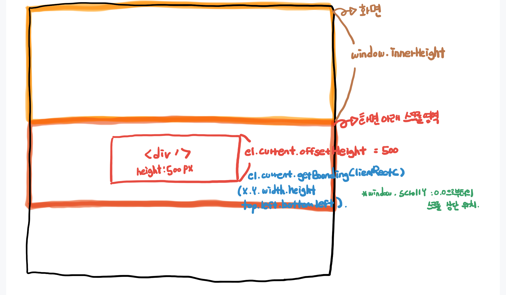

# height management

- innerHeight : 현재 보이는 화면의 높이
- scrollY : 스크롤이 움직이는 제일 상단의 높이
- offsetHeight : 대상이 되는 영역의 높이
- getBoundingClientRect : 대상이 되는 영역에 대한 정보 {x, y, width, height, top, left, right, bottom}

> 자세한 내용은 코드 console.log 확인

